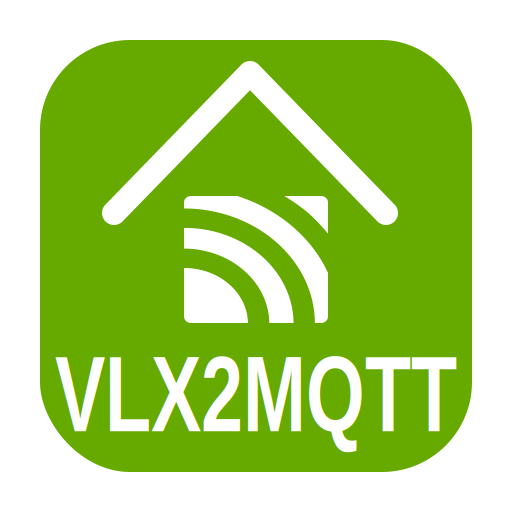

<p align="center">
  
</p>

<h1 align="center">VLX2MQTT Documentation</h1>

<p align="center">
  <strong>LoxBerry · MQTT · VELUX KLF200 · Loxone Config Export</strong>
</p>

<p align="center">
  
  
  
  
</p>

## Welcome

This is the documentation start page for **VLX2MQTT**. It is intended as the single entry point for the LoxBerry plugin web frontend and for GitHub visitors.

VLX2MQTT is a LoxBerry plugin that connects to a **VELUX KLF200 / Homecontrol IO** gateway, publishes device states via MQTT and accepts MQTT control commands. It also provides a **Loxone Config export** for virtual UDP inputs and virtual outputs.

## Choose your language

<p align="center">
  <a href="de/README.md"><strong>Deutsch</strong></a>
  &nbsp;&nbsp;|&nbsp;&nbsp;
  <a href="en/README.md"><strong>English</strong></a>
</p>

## Quick start

### 1. Install and configure

Configure KLF200 and MQTT connection in the LoxBerry web frontend or in:

```text
/opt/loxberry/config/plugins/vlx2mqtt/vlx2mqtt.cfg
```

### 2. Check MQTT output

```bash
mosquitto_sub -v -t 'vlx2mqtt/#'
```

### 3. Control a device

```text
vlx2mqtt/Fenster_links/set = DOWN
vlx2mqtt/Fenster_links/set = STOP
vlx2mqtt/Fenster_links/set = 65
```

### 4. Use Loxone export

Open the plugin web frontend and use **Loxone Config Export**:

```text
VirtualInUdp XML
VirtualOut XML
README
ZIP
```

## Documentation map

### Deutsch

- [Hauptdokumentation](de/README.md)
- [MQTT Topics](de/MQTT_TOPICS.md)
- [Loxone Config Export](de/LOXONE.md)
- [Recovery / Power-Cycle](de/RECOVERY.md)
- [Troubleshooting](de/TROUBLESHOOTING.md)

### English

- [Main documentation](en/README.md)
- [MQTT topics](en/MQTT_TOPICS.md)
- [Loxone Config export](en/LOXONE.md)
- [Recovery / power cycle](en/RECOVERY.md)
- [Troubleshooting](en/TROUBLESHOOTING.md)

## Important topics

| Topic | Documentation |
|---|---|
| MQTT states and commands | [DE](de/MQTT_TOPICS.md) / [EN](en/MQTT_TOPICS.md) |
| Numeric `*_code` topics | [DE](de/MQTT_TOPICS.md) / [EN](en/MQTT_TOPICS.md) |
| Loxone XML export | [DE](de/LOXONE.md) / [EN](en/LOXONE.md) |
| Recovery / power cycle | [DE](de/RECOVERY.md) / [EN](en/RECOVERY.md) |
| Service and diagnostics | [DE](de/TROUBLESHOOTING.md) / [EN](en/TROUBLESHOOTING.md) |

## Repository structure

```text
README.md
CHANGELOG.md
docs/
  README.md
  de/
  en/
examples/
  loxone/
```

---

<p align="center">
  <br>
  <strong>VLX2MQTT Documentation</strong><br>
  MQTT · LoxBerry · VELUX KLF200 · Loxone
</p>
